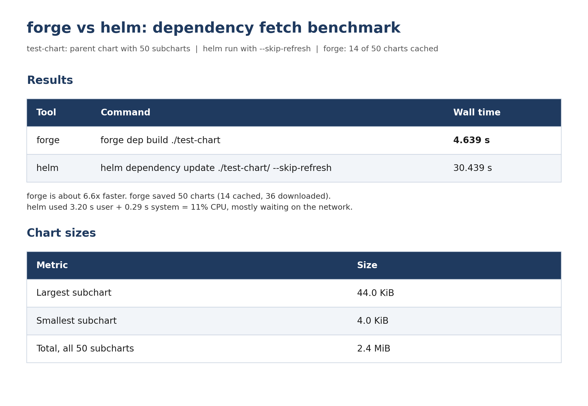

# forge

<p align="center">
  
</p>

`forge` replaces `helm dependency build` / `helm dependency update` for charts
whose dependencies live in OCI registries, classic chart repositories
(`https://…/index.yaml`) or local `file://` directories. It writes the same `charts/*.tgz`
and `Chart.lock` that Helm would, so `helm template`, `helm install` and
`helm package` keep working unchanged — they just get their dependencies
faster.

```sh
helm forge dep update ./my-chart   # resolve ranges, download, write Chart.lock
helm forge dep build  ./my-chart   # download exactly what Chart.lock pins
helm template my-release ./my-chart
```

`helm forge …` (the plugin) and `forge …` (the standalone binary) take the
same commands and flags.

## What's new in 2.0

- **Chart repositories and `file://` dependencies.** Besides OCI registries,
  forge now fetches from classic `https://…/index.yaml` repositories (including
  `@name` references from `helm repo add`) and packages local `file://` charts.
- **`-o json` output.** `dep build` and `dep update` can print one JSON report:
  per-dependency status, digest, size and a classified error code, plus request
  counts per host. See [Usage → JSON output](docs/usage.md#json-output).
- **Distributed as a Helm plugin.** Install with `helm plugin install`, run
  as `helm forge`. The Homebrew tap is discontinued.

## Install as a Helm plugin (recommended)

Needs Helm 3.18+ or Helm 4, on macOS, Linux or Windows (amd64/arm64).

1. Install, pinned to a release:

   ```sh
   # Helm 4: git sources can't be signature-verified, so --verify=false is required
   helm plugin install https://github.com/mmpyro/forge --version v2.0.0 --verify=false

   # Helm 3 (3.18+)
   helm plugin install https://github.com/mmpyro/forge --version v2.0.0
   ```

2. Check it:

   ```sh
   helm plugin list          # forge  2.0.0  …
   helm forge --version
   ```

3. Use it in place of `helm dependency`:

   ```sh
   helm forge dep update ./my-chart
   helm forge dep build  ./my-chart
   helm forge dep build  ./my-chart -o json
   ```

The install hook downloads the release binary for your OS/arch and checks it
against the release's `checksums.txt`; a mismatch aborts the install. Always
pass `--version`: without it Helm installs from `main`, which may name an
unpublished release.

Upgrade or remove:

```sh
helm plugin uninstall forge
helm plugin install https://github.com/mmpyro/forge --version vX.Y.Z [--verify=false]
```

Mirrors, troubleshooting and moving from Homebrew:
[Usage → Install](docs/usage.md#install).

## Standalone binary (v2.0.0)

Prebuilt binaries and `checksums.txt` are attached to every
[GitHub release](https://github.com/mmpyro/forge/releases). The links
below point at v2.0.0.

| Platform | Asset | Download |
|---|---|---|
| macOS (Apple Silicon) | `forge-darwin-arm64` | [Download](https://github.com/mmpyro/forge/releases/download/v2.0.0/forge-darwin-arm64) |
| macOS (Intel) | `forge-darwin-amd64` | [Download](https://github.com/mmpyro/forge/releases/download/v2.0.0/forge-darwin-amd64) |
| Linux (x86_64) | `forge-linux-amd64` | [Download](https://github.com/mmpyro/forge/releases/download/v2.0.0/forge-linux-amd64) |
| Linux (ARM64) | `forge-linux-arm64` | [Download](https://github.com/mmpyro/forge/releases/download/v2.0.0/forge-linux-arm64) |
| Windows (x86_64) | `forge-windows-amd64.exe` | [Download](https://github.com/mmpyro/forge/releases/download/v2.0.0/forge-windows-amd64.exe) |
| Windows (ARM64) | `forge-windows-arm64.exe` | [Download](https://github.com/mmpyro/forge/releases/download/v2.0.0/forge-windows-arm64.exe) |

Install on macOS / Linux:

```sh
os=$(uname -s | tr '[:upper:]' '[:lower:]')
arch=$(uname -m); case $arch in x86_64) arch=amd64 ;; aarch64) arch=arm64 ;; esac
curl -fsSL -o forge "https://github.com/mmpyro/forge/releases/download/v2.0.0/forge-$os-$arch"
chmod +x forge && sudo mv forge /usr/local/bin/
forge --version
```

To build from source, see [Usage → Install](docs/usage.md#install).

## Guides

| Document | Read it when you want to… |
|---|---|
| [Usage](docs/usage.md) | install forge, run it, set flags, cache it in CI, read its errors, parse its `-o json` output |
| [Architecture](docs/architecture.md) | understand how a run works and why it is fast and safe |
| [Development](docs/development.md) | build, test, regenerate goldens, run the compat gate and benchmark |

## Benchmark

A parent chart with 50 subcharts (2.4 MiB in total): `forge dep build` took
4.6 s, `helm dependency update --skip-refresh` took 30.4 s, about 6.6× faster.
forge started with 14 of the 50 charts in its cache; helm was mostly waiting on
the network (11 % CPU).



For a reproducible comparison (40 charts, +50 ms latency, cold and warm), run
`make bench`; see [Development → Benchmark](docs/development.md#benchmark--scriptsbenchsh).

## Why forge

- **Parallel.** Every dependency is fetched concurrently, with global and
  per-host limits.
- **One auth handshake per registry.** The first request to a host runs alone;
  the token it earns is reused by all the others.
- **Content-addressed cache.** Archives are stored by sha256 and shared across
  charts, aliases and processes. A warm `dep build` makes zero requests.
- **Atomic `charts/`.** Nothing in `charts/` changes unless every dependency
  succeeded.
- **Machine-readable reports.** `-o json` gives CI a stable error `code` per
  failed dependency instead of parsing text.
- **Helm-identical output.** Archive bytes, `Chart.lock` (apart from
  `generated:`) and `helm template` output are checked against real Helm 3 and
  Helm 4 in CI.

## Scope

Supported:

- `apiVersion: v2` charts
- dependencies with `repository:`
  - `oci://…` — OCI registries
  - `https://…` / `http://…` — classic chart repositories, whether or not
    they were added with `helm repo add`
  - `@name` / `alias:name` — repositories from Helm's `repositories.yaml`
    (credentials and TLS settings are used too)
  - `file://…` — local chart directories, packaged like Helm does
- exact versions and semver ranges (same resolver rules as Helm)
- aliases, conditions/tags, prerelease and build-metadata versions

Not supported (forge exits before any network call):

- dependencies without a `repository` (unpacked in `charts/`) and other
  schemes (`s3://`, plugin getters)
- `apiVersion: v1` charts

Not implemented yet: `push`/`pull`, `package`, adaptive concurrency, HTTP/3.

## License

MIT — see [LICENSE](LICENSE).
