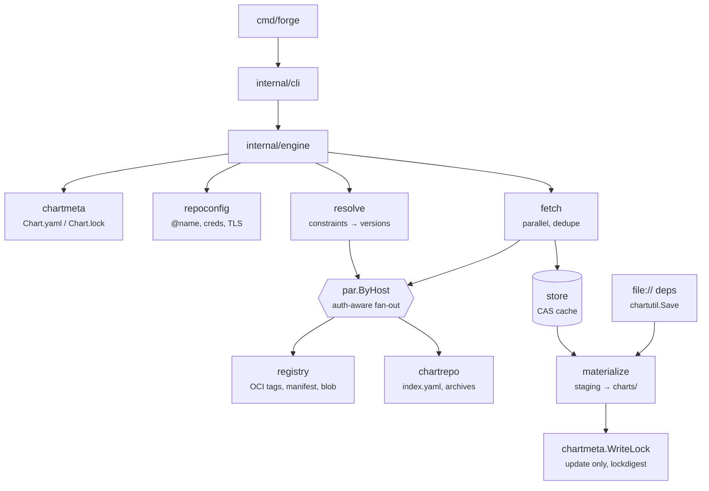
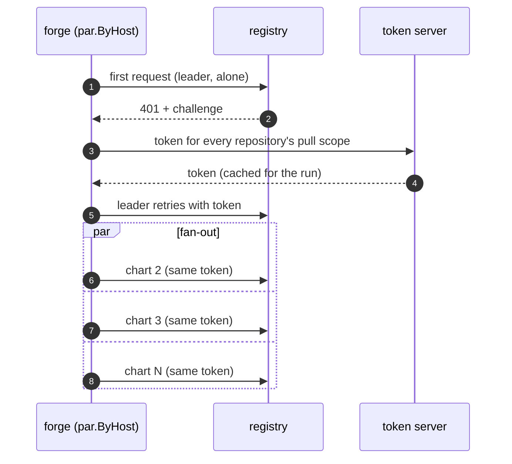

# Architecture

## A run, end to end



On the docs site, hover a box for its role and click it to jump to the
section that explains it.

`dep update`:

1. `chartmeta.Load` reads the chart with Helm's own loader (so dependency
   fields are sanitised exactly as Helm does before hashing). `apiVersion: v1`
   is rejected.
2. `prepare` checks every repository before any network call: `oci://`,
   `http(s)://`, `file://` (directory must exist) and `@name`/`alias:name`
   (must be in `repositories.yaml`; replaced by its URL, which is what Helm
   hashes and locks). Anything else is rejected.
3. `resolve.Resolve` turns constraints into versions:
   - OCI: exact versions skip the registry; each range repository's
     `tags/list` is fetched once.
   - Chart repositories: always from `index.yaml` (once per repository per
     run), so the lock gets the index's spelling, as in Helm.
   - `file://`: the local chart's version, if it satisfies the constraint.
4. `install` fetches every remote dependency and packages every `file://` one
   (see below). Any failure → stop, `charts/` untouched.
5. `lockdigest.Compute` hashes `[Chart.yaml deps, locked deps]`. If it equals
   the existing lock digest, `Chart.lock` is left alone; otherwise it is
   written byte-for-byte as Helm would.

`dep build`: load → `prepare` → verify the lock digest → `install`.
No lock at all → run `update`.

## Packages

| Package | Role |
|---|---|
| `cli` | cobra commands, flags, exit codes (`usageError` → 2), text and `-o json` output (`output.go`) |
| `engine` | `Build` / `Update` orchestration; `Summary` with one `Dep` (status, digest, size, placement, problem) per dependency; `DependencyError` |
| `chartmeta` | Load `Chart.yaml`/`Chart.lock` via Helm v4 SDK, write `Chart.lock` |
| `lockdigest` | Re-implementation of Helm's lock digest (Helm's is in an unimportable `internal/` package) |
| `resolve` | Semver constraint → exact version via OCI `tags/list`, `index.yaml` or the local `file://` chart |
| `registry` | oras-go client: credentials, shared token cache, error classification (`Classify` → `Problem` with a stable code); `registry.HTTP`: the run's HTTP/2 clients, limits, retries and per-host request counts |
| `chartrepo` | Classic chart repositories: `index.yaml` (parsed like Helm's `repo` package), archive URLs, credentials and TLS per repository |
| `repoconfig` | Helm's `repositories.yaml`: `@name` resolution, credentials, TLS config |
| `par` | `ByHost`: first request per host alone, then the rest in parallel |
| `fetch` | Parallel scheduler, dedupe by repo:version and by digest/URL, stream blob → store |
| `store` | Content-addressed cache |
| `materialize` | Place blobs into `charts/` via reflink → hardlink → copy, staging + swap |
| `testutil/fakeregistry` | In-memory OCI registry for unit tests, with request log and fault injection |
| `testutil/fakerepo` | In-memory chart repository for unit tests, with request log, basic auth and faults |

## Why it is fast

### One registry client per run

`registry.NewHTTP` builds the HTTP clients for the whole process, and
`registry.New` one oras `auth.Client` on top of them. All requests share
connections (HTTP/2 when offered), the token cache and the concurrency
limits. Chart repositories use the same clients and limits; one with its own
CA or client certificate gets a separate connection pool but the same
request budget.

### One auth handshake per registry

Firing 40 requests at a cold registry would trigger 40 `401` challenges and
40 token requests. Two things prevent that:

- `registry.WithPullScopes` puts *every* repository's pull scope into the
  first token request for each host, so one token covers them all.
- `par.ByHost` runs the first item of each host alone. Its challenge is
  answered and the token cached; then the rest of that host's items fan out.
  Leaders of different hosts run concurrently.



### Request budget

| Run | Requests |
|---|---|
| Cold `dep build` | ≈ `2 × unique OCI charts + 1 per registry` (manifest + blob per chart, one auth round), plus `1 × unique chart-repository charts + 1 index.yaml per repository` |
| Warm `dep build` | `0` |
| `dep update` | adds one `tags/list` per OCI repository that has a range constraint, and one `index.yaml` per chart repository |
| `file://` | `0` — packaged locally every run |

The integration tests assert these numbers through a counting proxy. Changing
fetch or auth ordering can break them.

### Deduplication

- Items with the same `repo:version` (e.g. three aliases of one chart) become
  one job.
- Jobs sharing a layer digest download it once (`singleflight` by digest).
- A blob already in the store is never downloaded again, whichever chart or
  project asked for it first.

### Limits and retries

`limitTransport` holds a global slot and a per-host slot per request **until
the response body is closed** — the transfer is still running after
`RoundTrip` returns. It takes the host slot first so a request queued on a
busy host does not block a global slot another host could use. Per-host
counting also means blob redirects (ECR → S3, GHCR → pkg-containers) get
their own budget.

Retries wrap the limiter, so a retry waits for a free slot like any other
request. Policy: `408`, `429`, `5xx`, network errors; 3 retries;
200 ms × 2ⁿ with 20 % jitter, or `Retry-After` up to 30 s.

## The run report

Every run builds an `engine.Summary`. The text output prints its counts; `-o json`
(`cli/output.go`) prints all of it. It is filled even when the run fails, so a
failed run still says what happened to each dependency.

- **Per dependency** (`Summary.Deps`, in `Chart.yaml` order): status
  (`cached`, `downloaded`, `local`, `failed`, `skipped`), locked version,
  digest and size (from `fetch.Result`), how it was placed in `charts/`
  (`materialize.Stage.Placement`) and how long it took.
- **Errors are classified, not just printed.** `registry.Classify` maps OCI
  errors, and `engine.repoProblem` maps chart repository errors, to a
  `registry.Problem`: a stable `code`, the HTTP status, a message and a hint.
  The text reason in `DependencyError` is derived from the same `Problem`, so
  text and JSON can't disagree.
- **Failures before fetching are attributed too.** `resolve.NoMatchError` and
  `engine.UnsupportedError` are typed, so the dependencies they name are
  `failed` and the rest `skipped`. Other early failures (lock out of sync,
  unknown `@name`, timeout) go to the top-level `error`.
- **Requests per host.** `registry.HTTP` wraps every client in two counting
  transports: one below the retry layer (every attempt, and `401` challenges)
  and one above it (logical requests); retries = attempts − logical. OCI
  registries and chart repositories share one `HTTP`, so the counts cover
  both. The integration tests check that these counts equal what the counting
  proxies saw.

## Distribution: the Helm plugin

forge ships as a Helm plugin (`plugin.yaml`, legacy format so Helm ≥ 3.18 and
Helm 4 both load it). `helm plugin install <repo> --version vX.Y.Z` clones the
repository at that tag; the platform install hook
(`scripts/install-plugin.sh` or `.ps1`) then downloads the release binary
named by `plugin.yaml`'s `version` and checks it against `checksums.txt`.
The release workflow refuses a tag that differs from that `version`.

When Helm runs a plugin it sets `HELM_PLUGIN_DIR`, `HELM_CACHE_HOME`,
`HELM_REGISTRY_CONFIG`, `HELM_REPOSITORY_CONFIG` and friends. forge reads
these, so `helm forge` uses Helm's credentials and repositories and keeps its
cache in `$HELM_CACHE_HOME/forge` (`store.DefaultRoot`).

## Why it is safe

### The store

```
$HELM_FORGE_CACHE/
  blobs/sha256/<hex>                 chart archives, mode 0444
  refs/<registry>/<repo>/<version>   JSON: manifest digest, layer digest, size, fetched_at
  refs/<scheme>/<host>/<path>/<chart>/<version>   same for chart repositories, plus the archive file name
  tmp/                               in-flight writes
```

- Every write goes to `tmp/` then is `rename`d into place, so concurrent forge
  processes share one cache without locks.
- Blobs are hashed while streaming; a mismatch is discarded and downloaded
  once more before failing.
- `Open` sweeps `tmp/` files older than an hour (left by crashed runs).
- A cached `refs/` entry is trusted unless `--refresh`. That is what makes a
  warm build zero requests.

### Atomic `charts/`

1. Archives are placed into `<chart>/.forge-staging/`. It sits at the chart
   root, not in `charts/`, because Helm would load a leftover directory in
   `charts/` as a broken subchart.
2. Only if **every** dependency succeeded, staged files are renamed into
   `charts/` and stale chart archives are removed (non-chart files and
   directories are kept, as Helm does).
3. On any error the staging directory is removed and `charts/` is untouched.
   A staging directory left by a killed run is wiped at the start of the next.

### Placing files

`place` tries, in order:

1. **reflink** — copy-on-write clone (`clonefile` on macOS/APFS,
   `FICLONE` on Linux btrfs/XFS). Independent file, no extra disk.
2. **hardlink** — shares the read-only cache inode. The archive in `charts/`
   is `0444`.
3. **copy** — plain `0644` copy, e.g. across filesystems.

## Helm is the oracle

forge's output must match real Helm, not a spec of Helm:

- `testdata/golden/` holds `Chart.lock` files produced by real
  `helm dependency update`. A mismatch is a forge bug — regenerate with
  `make golden`, never edit by hand.
- `make compat` runs every fixture through Helm 3, Helm 4 and forge and diffs
  `charts/` listings, archive sha256, `Chart.lock` (minus `generated:`) and
  `helm template` output.
- Resolver details copied from Helm: only strict semver tags count, `_` in a
  tag is read as `+`, exact versions are not looked up, highest match wins.
- Chart repository details copied from Helm: `index.yaml` is parsed strictly,
  invalid entries are dropped and versions sorted as Helm's `repo` package
  does; entries without URLs are skipped; archive URLs resolve relative to the
  repository URL; the archive keeps its URL's file name; credentials go only
  to the repository's scheme and host unless `pass_credentials_all`.
- `file://` charts are archived with Helm's `chartutil.Save`, so the tar
  stream matches Helm 4's for the same directory (tar mtimes come from the
  files). The gzip bytes can differ when forge and Helm were built with
  different Go versions, and Helm 3 stamps entries with the current time, so
  `make compat` compares these archives by member names and contents.
- One deliberate difference: `helm dependency build` refuses chart repository
  URLs that were never `helm repo add`-ed; forge fetches them anonymously.
